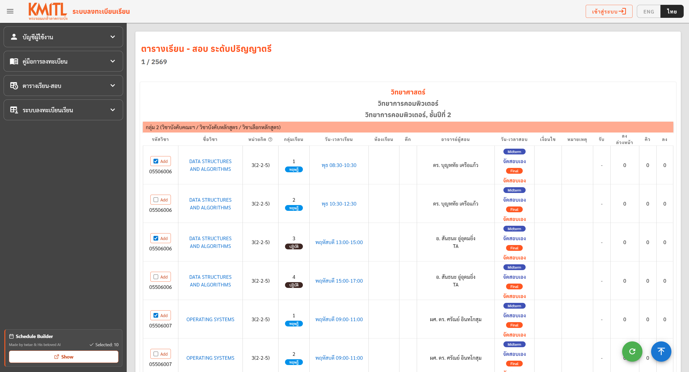
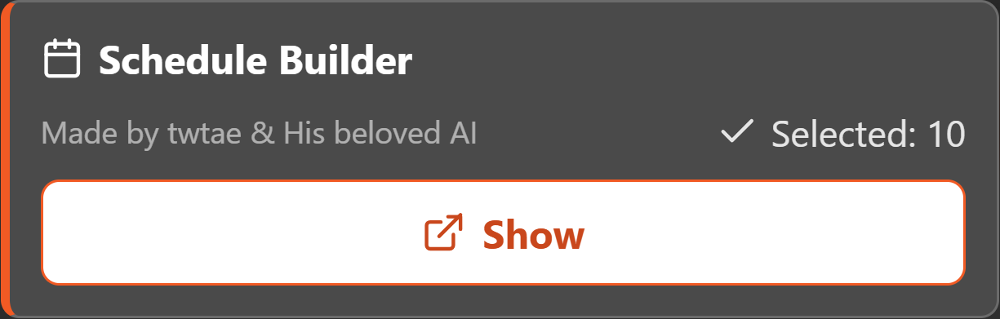
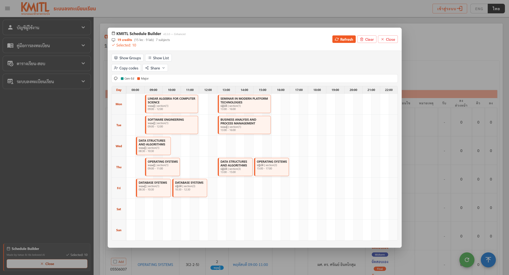

# KMITL Schedule Builder

An unofficial Chrome extension for the KMITL registration website (regis.reg.kmitl.ac.th). This tool allows students to select subjects from the teaching table and generate a custom timetable locally in the browser.

## Features

- Inline subject selection: Adds checkboxes directly to the KMITL subject table.
- Timetable Grid: Renders selected subjects into a weekly schedule with 30-minute slots.
- Conflict Detection: Automatically highlights overlapping classes.
- Grouping Summary: Shows a summary of selected theory, practical, and seminar components.
- Export Options: Download the timetable as a PNG image or copy data as plain text.
- Local Persistence: Selected subjects are saved in your browser and survive page refreshes.
- Dark Mode: Premium, site-wide dark theme for the entire registration website (`regis.reg.kmitl.ac.th`).

## Screenshots

### Subject selection



Select classes directly from the KMITL teaching table.

### Launcher



Open the builder from the fixed launcher without leaving the page.

### Timetable modal



Review selected classes in a weekly timetable.

### Exported PNG


Download the generated timetable as a PNG image for sharing or saving.

## Installation

There are two ways to install the extension locally.

### Option 1: Download from the release page

1. Go to the [Releases page](https://github.com/twtae/kmitl-schedule-builder-extension/releases).
2. Download the latest release ZIP, for example `kmitl-schedule-builder-extension-v0.4.0.zip`.
3. Extract the ZIP file.
4. Open Google Chrome and navigate to `chrome://extensions`.
5. Enable "Developer mode" using the toggle in the top-right corner.
6. Click the "Load unpacked" button.
7. Select the extracted extension folder, which contains `manifest.json`.

### Option 2: Clone the repository

1. Clone this repository:

   ```bash
   git clone https://github.com/twtae/kmitl-schedule-builder-extension.git
   ```

2. Open Google Chrome and navigate to `chrome://extensions`.
3. Enable "Developer mode" using the toggle in the top-right corner.
4. Click the "Load unpacked" button.
5. Select the cloned repository folder, which contains `manifest.json`.

## Usage

1. Navigate to `https://regis.reg.kmitl.ac.th/#/teach_table_selector`.
2. Select the term, curriculum, and teaching table options on the KMITL page.
3. Continue to the teaching table route (`#/teach_table`).
4. Check the "Add" boxes next to the subjects you want to include.
5. Use the "Schedule Builder" launcher in the bottom-left corner to open the timetable modal.
6. Review your schedule, check for conflicts, and use the export buttons to save your plan.
7. Click the extension icon in your browser toolbar to toggle Dark Mode on/off. The preference is stored locally and applies immediately across all pages on the site.

## Privacy and Safety

- No Backend: This extension does not use any external servers.
- No Data Collection: No user data, analytics, or tracking information is collected.
- No Credential Access: The extension does not access cookies, login data, or passwords.
- Local Storage: All selected subjects are stored strictly on your local device via chrome.storage.local.

## Disclaimer

This is an unofficial project. It is not affiliated with, endorsed by, or maintained by King Mongkut's Institute of Technology Ladkrabang (KMITL). This tool is for planning purposes only and does not perform actual registration.

## Known Limitations

- Layout Dependency: The subject detection logic depends on the current HTML structure of the KMITL registration site.
- Planning Only: Final schedules should always be verified against the official registration system.

## Development Notes

- Manifest V3 compliant.
- Built using Vanilla JavaScript and CSS.
- No external libraries or remote assets are used.
- Runs only on the KMITL `#/teach_table` route.

## Credits

Made by twtae & His beloved AI
